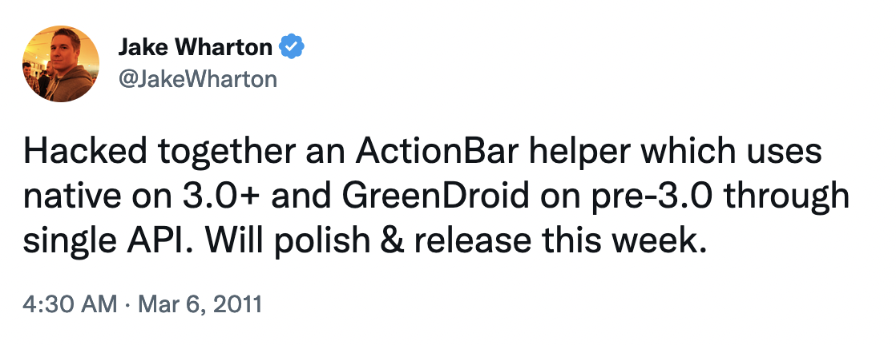
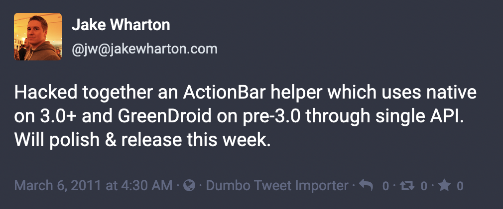

# Dumbo Tweet Importer

Import a Twitter archive into a Mastodon account.

| Twitter                | Mastodon              |
|------------------------|-----------------------|
|  |  |

## Usage

Dumbo requires modifications be made to your Masotodon server.
The Mastodon API does not allow inserting posts in the past.
In order to write statuses which occur in the past, a `created_at` parameter is needed.

### Modifying Official Mastodon

The following changes should be applied to the Mastodon app.
Note: These diffs were produced against Mastodon v3.5.3.
If you are using Mastodon v4 (or newer) you may need to adjust them.

`app/controllers/api/v1/statuses_controller.rb`:
```diff
@@ -46,4 +46,5 @@
       visibility: status_params[:visibility],
       language: status_params[:language],
+      created_at: status_params[:created_at],
       scheduled_at: status_params[:scheduled_at],
       application: doorkeeper_token.application,
@@ -110,4 +111,5 @@
       :visibility,
       :language,
+      :created_at,
       :scheduled_at,
       media_ids: [],
```

`app/services/post_status_service.rb`:
```diff
@@ -95,6 +95,8 @@
     Trends.tags.register(@status)
     LinkCrawlWorker.perform_async(@status.id)
-    DistributionWorker.perform_async(@status.id)
-    ActivityPub::DistributionWorker.perform_async(@status.id)
+    if not @options[:created_at]
+      DistributionWorker.perform_async(@status.id)
+      ActivityPub::DistributionWorker.perform_async(@status.id)
+    end
     PollExpirationNotifyWorker.perform_at(@status.poll.expires_at, @status.poll.id) if @status.poll
   end
@@ -168,4 +170,5 @@
       visibility: @visibility,
       language: valid_locale_cascade(@options[:language], @account.user&.preferred_posting_language, I18n.default_locale),
+      created_at: @options[:created_at],
       application: @options[:application],
       rate_limit: @options[:with_rate_limit],
```

Apply these patches and then restart the app or container.

When you are completely done with your import you can undo these changes.
Either revert manually, reinstall the app, or recreate the container.

### Running Dumbo

TODO

# License

    Copyright 2022 Jake Wharton

    Licensed under the Apache License, Version 2.0 (the "License");
    you may not use this file except in compliance with the License.
    You may obtain a copy of the License at

       http://www.apache.org/licenses/LICENSE-2.0

    Unless required by applicable law or agreed to in writing, software
    distributed under the License is distributed on an "AS IS" BASIS,
    WITHOUT WARRANTIES OR CONDITIONS OF ANY KIND, either express or implied.
    See the License for the specific language governing permissions and
    limitations under the License.
